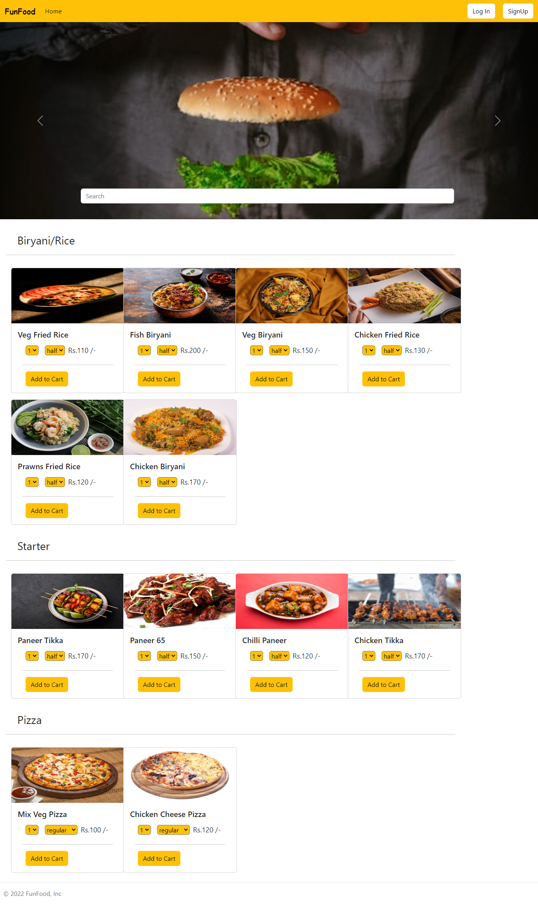
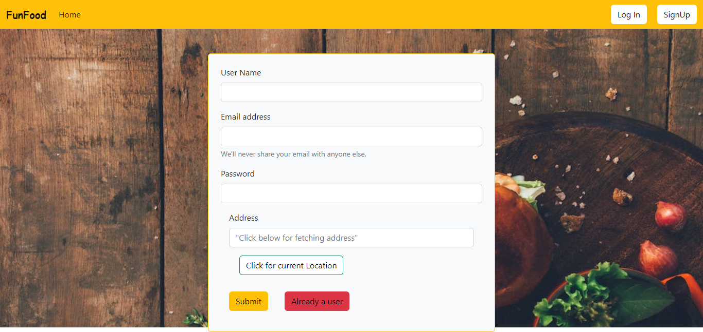
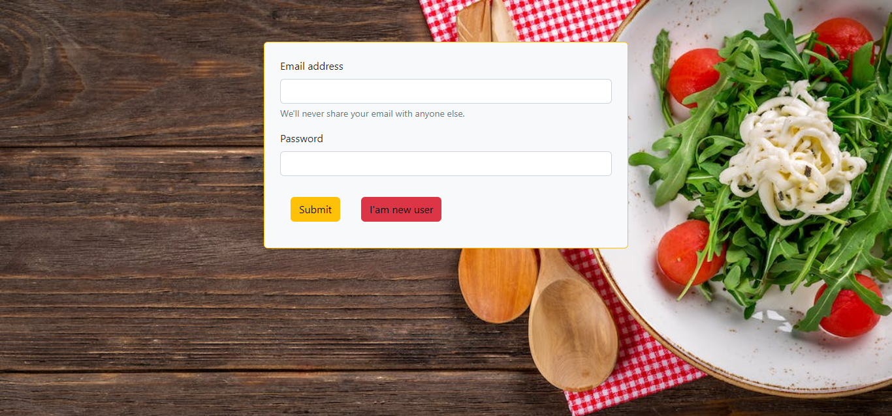

# Fun Food

A food delivery app 
Food app is for ordering food and door-step delivery in this the user can select the different categories from the menu.There are Starter, Snack, & other options are available.

# Home

# Create User

# Login

## Tech Stack

- HTML/CSS
- ReactJS
- Bootstrap
- NodeJS
- MongoDB
- ExpressJS

## Author

-   Himanshika Rawat - follow me on 👇
-   [GitHub](https://www.github.com/himanshirawat)
-   [LinkedIn](https://www.linkedin.com/in/himanshi-rawat/)
-   [Pinterest](https://in.pinterest.com/himanshikarawat/)

## Available Scripts

In the project directory, you can run:

### `npm start`

Runs the app in the development mode.\
Open [http://localhost:3000](http://localhost:3000) to view it in your browser.

The page will reload when you make changes.\
You may also see any lint errors in the console.

